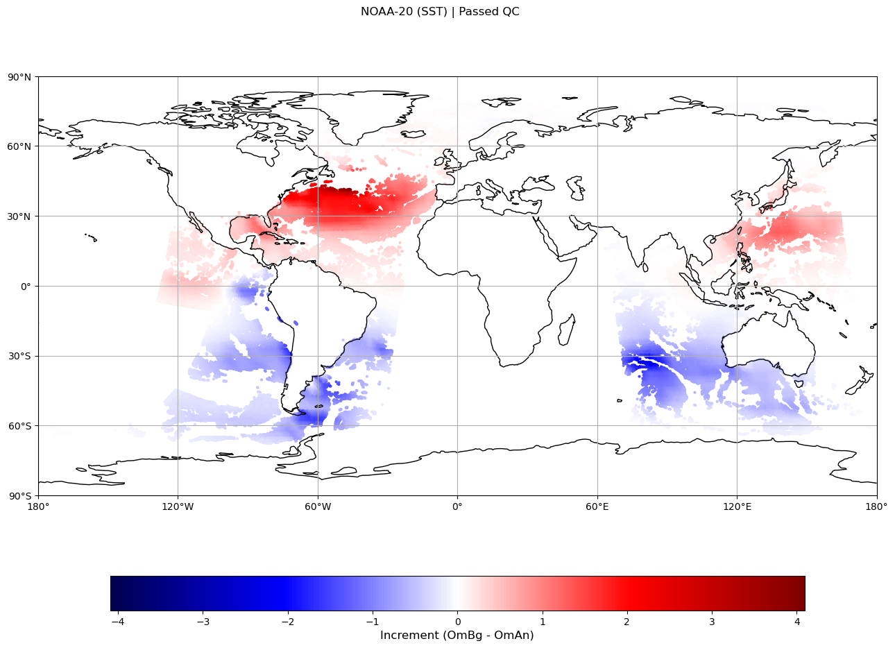
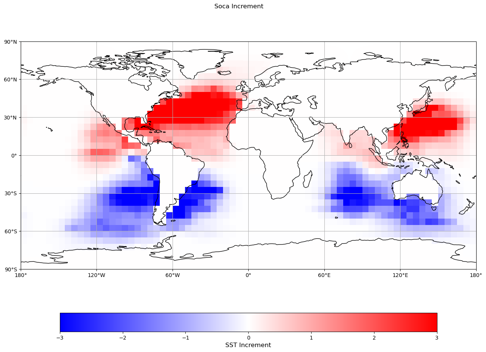
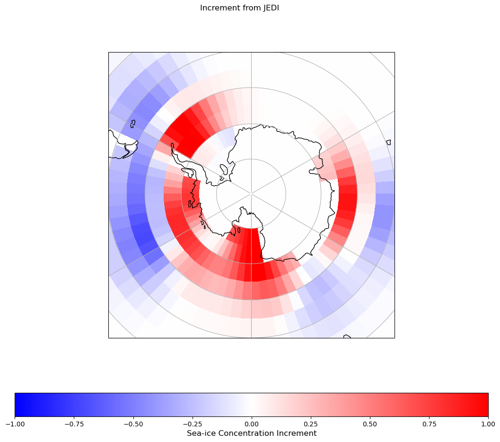

## Create a Swell 3DFGAT_marine_cycle experiment:

3DFGAT is a particular flavor of 3DVar which uses multiple background states. Hence, in SWELL universe, the `window_type`
is defined as 4D. However, **B** is not propagated as in it would in a proper 4DVar application.

To create a 3dfgat_marine_cycle suite, run the following command:

```bash
swell create 3dfgat_marine_cycle
```

For this tutorial, we will use the override option (`-o` or `--override`):

```bash
swell create 3dfgat_marine_cycle -o override.yaml
```

Where the `override.yaml` contains the following keys to override defaults:

```yaml
experiment_root: /discover/nobackup/dardag/test_folder
experiment_id: fgat_test
```

With this, the following experiment folder will be created:
`/discover/nobackup/dardag/test_folder/fgat_test`

Another critical input argument for `swell create` is  `-s slurmfile.yaml`. Please see [slurm config instructions](configs/slurm_configuration.md) for more details on how to use it for high resolution tests. Below `experiment.yaml` will show a 5-deg setup created with a 0.25-deg `slurmfile.yaml` to demonstrate the  proper use of `slurmfile.yaml` though 1 node configurations will suffice for a 5-deg cycle.

Before launching the experiment, let's take a look at the `experiment.yaml`.

## Inside `experiment.yaml`:

The `experiment.yaml` is located at:
`/discover/nobackup/dardag/test_folder/fgat_test/fgat_test-suite/experiment.yaml`

For `3dfgat_marine_cycle` defaults (with the experiment root and id override and `slurmfile.yaml`), this is the `experiment.yaml`:

```yaml
# What is the experiment id?
experiment_id: fgat_test

# What is the experiment root (the directory where the experiment will be stored)?
experiment_root: /discover/nobackup/dardag/test_folder

# What is the time of the first cycle (middle of the window)?
start_cycle_point: '2021-07-02T06:00:00Z'

# What is the time of the final cycle (middle of the window)?
final_cycle_point: '2021-07-02T12:00:00Z'

# List of models in this experiment
model_components:
- geos_marine

# Set the Cylc runahead limit: the maximum number of cycles that may be active ahead of the current cycle (e.g. P1: up to 1 cycle ahead, P3: up to 3 cycles ahead, default P4).
runahead_limit: P2

# Do you want to use an existing JEDI build or create a new build?
jedi_build_method: use_existing

# Do you want to use an existing GEOS build or create a new build?
geos_build_method: use_existing

# What is the path to the existing GEOS build directory?
existing_geos_gcm_build_path: /discover/nobackup/projects/gmao/SIteam/Models/GEOSgcm-GCMv12-rc12/install

# What is the path to the Swell Static files directory?
swell_static_files: /discover/nobackup/projects/gmao/advda/SwellStaticFiles

# What is the path to the user provided Swell Static Files directory?
swell_static_files_user: None

# What is the location for the HOME Directory (HOMDIR in gcm_run and gcm_setup) that contains model settings and RC files?
geos_homdir: /discover/nobackup/projects/gmao/advda/SwellStaticFiles/geos/homdirs/coupled_5deg

# Is your GEOS EXPERIMENT Directory, where restarts and scratch is located, different than your GEOS HOME Directory?
geos_expdir_different: false

# GEOS forecast duration
forecast_duration: PT12H

# What is the path to the existing JEDI build directory?
existing_jedi_build_directory: /discover/nobackup/projects/gmao/advda/swell/JediBundles/fv3_soca_SLES15_01152026/build-intel-release/

# What is the path to the existing GEOS source code directory?
existing_geos_gcm_source_path: /discover/nobackup/projects/gmao/SIteam/Models/GEOSgcm-GCMv12-rc12/

# What is the path to the existing JEDI source code directory?
existing_jedi_source_directory: /discover/nobackup/projects/gmao/advda/swell/JediBundles/fv3_soca_SLES15_01152026/

# How should initial GEOS restarts be obtained?
initial_restarts_method: geos_expdir

# Configurations for the model components.
models:

  # Configuration for the geos_marine model component.
  geos_marine:

    # Enter the cycle times for this model.
    cycle_times:
    - T00
    - T06
    - T12
    - T18

    # Select the active SOCA models for this model.
    marine_models:
    - mom6
    - cice6

    # Provide the log naming convention (e.g. 'variational', 'fgat').
    comparison_log_type: fgat

    # Do you wish to use IAU for MOM6?
    mom6_iau: true

    # What is the IAU length (ODA_INCUPD_NHOURS) for MOM6?
    mom6_iau_nhours: PT3H

    # What are the analysis variables?
    analysis_variables:
    - sea_water_salinity
    - sea_water_potential_temperature
    - sea_surface_height_above_geoid
    - sea_water_cell_thickness
    - sea_ice_area_fraction
    - sea_ice_thickness
    - sea_ice_snow_thickness

    # Do you want to use a 3D or 4D (including FGAT) window?
    window_type: 4D

    # What forecast model should be used within JEDI for 4D window propagation?
    jedi_forecast_model: NA

    # Which observations do you want to include?
    observations:
    - adt_cryosat2n
    - adt_jason3
    - adt_saral
    - adt_sentinel3a
    - adt_sentinel3b
    - insitu_profile_argo
    - icec_amsr2_north
    - icec_amsr2_south
    - icec_nsidc_nh
    - icec_nsidc_sh
    - sst_ostia
    - sss_smos
    - sss_smapv5
    - sst_abi_g16_l3c
    - sst_gmi_l3u
    - sst_viirs_n20_l3u
    - temp_profile_xbt

    # What is the number of processors for JEDI?
    total_processors: 6

    # What is the duration for the data assimilation window?
    window_length: PT6H

    # How long before the middle of the analysis window did the background providing forecast begin?
    background_time_offset: PT9H

    # Provide a list of patterns that you wish to remove from the cycle directory.
    clean_patterns:
    - '*.nc4'
    - '*.txt'
    - '*.rc'
    - '*.bin'

    # What is the horizontal resolution for the forecast model and backgrounds?
    horizontal_resolution: 72x36

    # What is the database providing the observations?
    obs_experiment: s2s_v1

    # What is the vertical resolution for the forecast model and background?
    vertical_resolution: '50'

    # Which background error model do you want to use?
    background_error_model: explicit_diffusion

    # What value of gradient norm reduction for convergence?
    gradient_norm_reduction: 1e-10

    # Which data assimilation minimizer do you wish to use?
    minimizer: RPCG

    # What number of iterations do you wish to use for each outer loop? Provide a list of integers the same length as the number of outer loops.
    number_of_iterations:
    - 10

    # What is the frequency of the background files?
    background_frequency: PT3H

    # Perform check for observations? Set to false for debugging purposes.
    check_for_obs: true

    # Treat observations as 'local' to the directory?
    set_obs_as_local: false

# Generate JEDI executable YAML and exit?
generate_yaml_and_exit: false

# Datetime this file was created (auto added)
datetime_created: 20260223_121331Z

# Computing platform to run the experiment
platform: nccs_discover_sles15

# Record of the suite being executed
suite_to_run: 3dfgat_marine_cycle

slurm_directives_tasks:
  RunJediConvertStateSoca2ciceExecutable:
    geos_marine:
      nodes: 7
      ntasks-per-node: 110
  RunJediFgatExecutable:
    geos_marine:
      nodes: 10
      ntasks-per-node: 100
  GenerateBClimatology:
    geos_marine:
      nodes: 6
      ntasks-per-node: 126
  RunGeos:
    all:
      nodes: 10
      ntasks-per-node: 126
```

Most of these configurations are self explanatory, we will mention some of them here:

- `clean_patterns`: This key controls which files will be erased after the experiment run is complete.
Currently, `IODA` output files are erased after the diagnostic plots (using EVA) are created.

- `generate_yaml_and_exit`: When this key is `True`, the code will progress right before the execution of the variational application
and generate a JEDI Config YAML. This could be useful while debugging problems but it will prevent cycling and fail the suite.

  Unless the user specifies their own `swell_static_files_user`, SWELL will use the default static
folder for GEOS restarts and experiment directory:

- `geos_homdir`: For this example, `swell_static_files` is set as the NCCS Discover default;
`/discover/nobackup/projects/gmao/advda/SwellStaticFiles`. So SWELL will look for `/discover/nobackup/projects/gmao/advda/SwellStaticFiles/geos/homdirs/coupled_5deg` for GEOS experiment setup. This could be any external GEOS experiment setup.

- `geos_expdir_different`: In some rare GEOSgcm setups, homdir and expdir are different. This switch allows this difference to be handled within SWELL. The default is `False` and `geos_homdir` and `geos_expdir` are identical.

- `geos_expdir`: SWELL will look into this folder to obtain coupled restarts. Depending on the `geos_expdir_different` switch this folder may be different or identical to `geos_homdir`. In this SOCA setup coupled restarts will be copied, such as `*_rst` files, `MOM.res.nc`, and `iced.nc`. If hotstart option is chosen for `initial_restarts_method`, restart files in experiment `forecast` directory will be used so no copying will occur.

- `marine_models`: JEDI/SOCA interface is designed to handle multiple marine model outputs. Currently in SWELL,
`mom6` and `cice6` model interfaces are supported. `mom6` should always be active for `SOCA` however `cice6` is
optional. If `cice6` model is not active one should take out sea-ice related observations and variables from the `experiment.yaml` and from the `analysis_variables`.

- `mom6_iau`: This is optional, however highly recommended for model stability. See [MOM6 settings](configs/model_configurations/mom6.md) for details.

- `mom6_iau_nhours`: This number is set in `MOM_oda_incupd` module, which is augmented to `MOM_input` file. Now it is possible to manually adjust this value. Recommended values for 6h and 1-day DA windows are 3h and 18h, respectively.

- `obs_provider`: For marine observations, two providers are used `odas` (GMAO) and `gdas_marine` (NOAA-EMC). R2D2 will
scan Local and Shared (GMAO-wide) locations for these two providers.

### Making changes with `override.yaml`:

If you would like to change any of these parameters, it is suggested to copy `experiment.yaml`
to `override.yaml` and make desired configuration changes. Afterwards, create the experiment again:

```bash
swell create 3dfgat_marine_cycle -o override.yaml
```

However, most of these settings, especially the ones pertaining the DA windows, are tied to the way observation and background files are organized within the R2D2 (database) folders. So, making these changes will likely break things until relevant observation or background files are created.

## Launch the experiment:

After the `create` step is finished via using defaults (or `CLI`), Swell will provide you with the command to launch
the experiment, which will depend on your `experiment_root` and `experimetn_id` and look something like
the following:

```bash
swell launch /discover/nobackup/dardag/test_folder/fgat_test/fgat_test-suite
```

Executing this command will launch the experiment and bring up the TUI.

You can exit the TUI by pressing q at any time and interact with certain tasks, including running failed tasks again.

## While the suite is running:

In this example, `geos_marine` is running with `MOM6` and `CICE6` models and it will cycle for two time steps beginning from `20210701T060000Z` till `20210701T120000Z` using a 6-hr DA window.

As some of the tasks start executing, there will be two new folders created inside the experiment directory:

```bash
fgat_test/
├── configuration
├── fgat_test-suite/
├── GEOSgcm
│   ├── build -> /discover/nobackup/projects/gmao/SIteam/Models/GEOSgcm-GCMv12-rc12/install
│   ├── forecast
│   ├── GEOS_homdir -> /discover/nobackup/projects/gmao/advda/SwellStaticFiles/geos/homdirs/coupled_5deg
│   └── source -> /discover/nobackup/projects/gmao/SIteam/Models/GEOSgcm-GCMv12-rc12/
├── jedi_bundle
└── run
```

- `GEOSgcm`: Hosts all GEOS related folders including links to an existing GEOS build/source folders using the `existing_geos_gcm_build_path` and `existing_geos_gcm_source_path` entries. It also contains the `GEOS_homdir`, where an
additional link is created for an existing GEOS experiment, defined with `geos_homdir` key. Finally, `forecast` folder here contains the deterministic forecast folder, where the `RunGeos` task will execute. During model execution, `scratch` directory will be created under the `forecast` directory and typical GEOS experiment outputs (e.g, MAPL HISTORY) will be stored here.

Users can also choose to build their own build by changing the `geos_build_method` in the `experiment.yaml`. However building GEOS from scratch could take up to an hour and requires significant IOnodes and storage space.

- `jedi_bundle`: Simply points (links) to an existing JEDI build/source folders. Users can also choose to
build their own bundle by changing the `jedi_build_method` in the `experiment.yaml`. However building JEDI from scratch could
take up to an hour depending on how many bundles are chosen to be built.

- `run`: This is where the cycling folders are created under. Each cycle will be organized under date stamped
folders under the `run` folder. In an active cycle, a time stamped folder will be created under the `run` directory, in SWELL referred as the "cycle directory":

    ```bash
    run
    └── 20210701T060000Z
        └── geos_marine
            ├── background_error_model/
            ├── INPUT/
            ├── eva/
            ├── soca/
            └── ...
    ```

## After the run is complete:

Let's take a look at the `geos_marine` folder after the run is complete.

```bash
run
└── 20210701T120000Z
    └── geos_marine
        ├── background_error_model/
        ├── INPUT/
        ├── eva/
        ├── soca/
        └── ...
```

`background_error_model/`: (Only `EXPLICIT_DIFFUSION` is supported for now) These files are needed to define the background
error covariance. The folder contains Rossby radius dependent horizontal correlation scale files and MLD dependent vertical
correlation scale file.

`eva/`: Contains all of the plots that were generated for each observation source, restart (once the increment is active), and
JEDI log outputs. Currently, all of the plots are created in batches and organized under the observation type.

`INPUT/`: Contains static and resolution dependent MOM6 files.

`soca/`: Contains static and common (i.e., resolution independent) SOCA related files.

Some of the other files located in the cycle directory:

`cycle_done`: Indicates succesful execution of a particular cycle.

`jedi_fgat_config.yaml`: JEDI configuration file, created right before the 3dfgat_marine_cycle application is executed.

`jedi_fgat_log.log`: Output of the JEDI execution, contains important information pertaining cost functions, number of observations assimilated, and iterations.

Analysis and increment files:

1) `ocn.fgat_test.an.2021-07-01T12:00:00Z.nc` and `ocn.fgat_test.inc.2021-07-01T12:00:00Z.nc`
2) `ice.fgat_test.an.2021-07-01T12:00:00Z.nc` and `ice.fgat_test.inc.2021-07-01T12:00:00Z.nc`

>⚠️ **NOTE:** Currently, ocean increment file is combined with `h` variable from analysis to create `mom6_increment.nc` then this file is used in MOM6 IAU for the next forward cycle. Work is underway to save these increments to R2D2.

## NOAA-20 (SST) and analysis increments for the default 3dfgat_marine_cycle test:

The test should produce the NOAA-20 SST increment for 2021/07/02 at 06Z:



The test also should produce the following increments in the cycle directory under `eva/increment`. Notice these plots are in state space (5-deg) hence these results are for demonstration purposes only:



