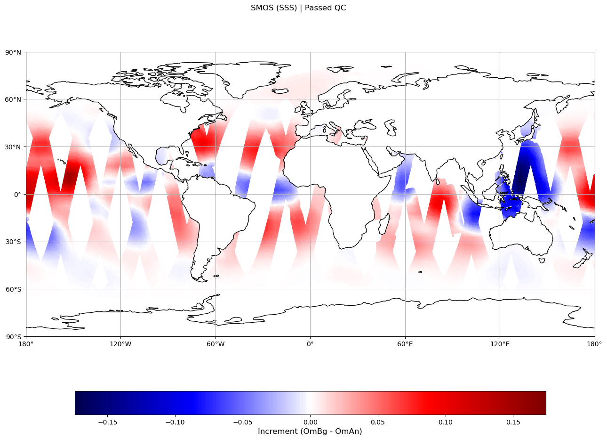

## Create a Swell 3DVar_marine experiment:

To create a 3dvar_marine suite, run the following command:

```bash
swell create 3dvar_marine
```

For this tutorial, we will use the override option (`-o` or `--override`):

```bash
swell create 3dvar_marine -o override.yaml
```

Where the `override.yaml` contains the following keys to override defaults:

```yaml
experiment_root: /discover/nobackup/dardag/test_folder
experiment_id: test001
```

With this, the following experiment folder will be created:
`/discover/nobackup/dardag/test_folder/test001`

Before launching the experiment, let's take a look at the `experiment.yaml` experiment configuration.

## Inside `experiment.yaml`:

The `experiment.yaml` is located at:
`/discover/nobackup/dardag/test_folder/test001/test001-suite/experiment.yaml`. These configurations and outputs may display some minor differences dependening on SWELL and JEDI updates.

For `3dvar_marine` defaults (with the experiment root and id override), this will be the `experiment.yaml`:

```yaml
# What is the experiment id?
experiment_id: test001

# What is the experiment root (the directory where the experiment will be stored)?
experiment_root: /discover/nobackup/dardag/test_folder

# What is the time of the first cycle (middle of the window)?
start_cycle_point: '2021-07-01T12:00:00Z'

# What is the time of the final cycle (middle of the window)?
final_cycle_point: '2021-07-01T12:00:00Z'

# List of models in this experiment
model_components:
- geos_marine

# Set the Cylc runahead limit: the maximum number of cycles that may be active ahead of the current cycle (e.g. P1: up to 1 cycle ahead, P3: up to 3 cycles ahead, default P4).
runahead_limit: P4

# Do you want to use an existing JEDI build or create a new build?
jedi_build_method: use_existing

# What is the path to the existing JEDI build directory?
existing_jedi_build_directory: /discover/nobackup/projects/gmao/advda/swell/JediBundles/fv3_soca_SLES15_01152026/build-intel-release/

# What is the path to the existing JEDI source code directory?
existing_jedi_source_directory: /discover/nobackup/projects/gmao/advda/swell/JediBundles/fv3_soca_SLES15_01152026/

# Configurations for the model components.
models:

  # Configuration for the geos_marine model component.
  geos_marine:

    # Enter the cycle times for this model.
    cycle_times:
    - T12

    # Select the active SOCA models for this model.
    marine_models:
    - mom6

    # Perform check for observations? Set to false for debugging purposes.
    check_for_obs: true

    # How long before the middle of the analysis window did the background providing forecast begin?
    background_time_offset: PT18H

    # Which observations do you want to include?
    observations:
    - adt_cryosat2n
    - adt_jason3
    - adt_saral
    - adt_sentinel3a
    - adt_sentinel3b
    - insitu_profile_argo
    - sst_ostia
    - sss_smos
    - sss_smapv5
    - sst_abi_g16_l3c
    - sst_gmi_l3u
    - sst_viirs_n20_l3u
    - temp_profile_xbt

    # Treat observations as 'local' to the directory?
    set_obs_as_local: false

    # What is the duration for the data assimilation window?
    window_length: P1D

    # What is the database providing the observations?
    obs_experiment: s2s_v1

    # What is the horizontal resolution for the forecast model and backgrounds?
    horizontal_resolution: 72x36

    # What is the vertical resolution for the forecast model and background?
    vertical_resolution: '50'

    # Do you want to use a 3D or 4D (including FGAT) window?
    window_type: 3D

    # What is the name of the name of the experiment providing the backgrounds?
    background_experiment: s2s

    # Provide a list of patterns that you wish to remove from the cycle directory.
    clean_patterns:
    - '*.nc4'
    - '*.txt'

    # What are the analysis variables?
    analysis_variables:
    - sea_water_salinity
    - sea_water_potential_temperature
    - sea_surface_height_above_geoid
    - sea_water_cell_thickness

    # What value of gradient norm reduction for convergence?
    gradient_norm_reduction: 1e-10

    # Which data assimilation minimizer do you wish to use?
    minimizer: RPCG

    # What number of iterations do you wish to use for each outer loop? Provide a list of integers the same length as the number of outer loops.
    number_of_iterations:
    - 5

    # What is the number of processors for JEDI?
    total_processors: 6

    # Provide the log naming convention (e.g. 'variational', 'fgat').
    comparison_log_type: variational

    # Which background error model do you want to use?
    background_error_model: explicit_diffusion

# What is the path to the Swell Static files directory?
swell_static_files: /discover/nobackup/projects/gmao/advda/SwellStaticFiles

# What is the path to the user provided Swell Static Files directory?
swell_static_files_user: None

# Generate JEDI executable YAML and exit?
generate_yaml_and_exit: false

# Datetime this file was created (auto added)
datetime_created: 20260223_111952Z

# Computing platform to run the experiment
platform: nccs_discover_sles15

# Record of the suite being executed
suite_to_run: 3dvar_marine
```

Most of these configurations are self explanatory, we will mention only a few here for now.

`clean_patterns`: This key controls which files will be erased after the experiment run is complete.
Currently, `IODA` output files are erased after the diagnostic plots (using EVA) are created.

`generate_yaml_and_exit`: When this key is `True`, the code will progress right before the execution
and generate a JEDI Config YAML. This could be useful while debugging problems.


`marine_models`: JEDI/SOCA interface is designed to handle multiple marine model outputs. Currently in SWELL,
`mom6` and `cice6` model interfaces are supported. `mom6` should always be active for `SOCA` however `cice6` is
optional. If `cice6` model is not active users should take out sea-ice related observations and variables from the `experiment.yaml` and from the `analysis_variables`.

If you would like to change any of these parameters, it is suggested to copy `experiment.yaml`
to `override.yaml` and make desired configuration changes. Afterwards, create the experiment again:

```bash
swell create 3dvar_marine -o override.yaml
```

However, most of these settings, especially the ones pertaining the DA windows are tied to the way observation and background files are organized within the R2D2 (database) folders. So, making these changes will likely break things until these observation or background files are replaced.

## Launch the experiment:

After the `create` step is finished via using defaults (or `CLI`), Swell will provide you with the command to launch
the experiment, which will depend on your `experiment_root` and `experimetn_id` and look something like
the following:

```bash
swell launch /discover/nobackup/dardag/test_folder/test001/test001-suite
```

Executing this command will launch the experiment and bring up the TUI.

You can exit the TUI by pressing q at any time and interact with certain tasks, including running failed tasks again.

## While the suite is running:

As some of the tasks start executing, there will be two new folders created inside the experiment directory:

```bash
test001/
├── configuration
├── test001-suite/
├── jedi_bundle
└── run
```

`jedi_bundle`: Simply points (links) to an existing JEDI build/source folders. Users can also choose to
build their own bundle by changing the `jedi_build_method` in the `experiment.yaml`. However building JEDI from scratch could
take up to an hour depending on how many bundles are chosen to be built.

`run`: This is the `scratch` directory analogue in GEOSgcm. Each cycle will be organized under date stamped
folders under the `run` folder.

If all goes well, the run will complete successfully.

## After the run is complete:

In this default example, there is a single model type (`geos_marine`) that contains a single cycle (`20210701T120000Z`).

Let's take a look at the `geos_marine` folder after the run is complete.

```bash
run
└── 20210701T120000Z
    └── geos_marine
        ├── background_error_model/
        ├── INPUT/
        ├── eva/
        ├── soca/
        └── ...
```

`background_error_model/`: (Only `EXPLICIT_DIFFUSION` is supported for now) These files are needed to define the background
error covariance. The folder contains Rossby radius dependent horizontal correlation scale files and MLD dependent vertical
correlation scale file.

`eva/`: Contains all of the plots that were generated for each observation source, restart (once the increment is active), and
JEDI log outputs. Currently, all of the plots are created in batches and organized under the observation type.

`INPUT/`: Contains static and resolution dependent MOM6 files.

`soca/`: Contains static and common (i.e., resolution independent) SOCA related files.

Some of the other files located in the cycle directory:

`cycle_done`: Indicates succesful execution of a particular cycle.

`jedi_variational_config.yaml`: JEDI configuration file, created right before the 3dvar application is executed.

`jedi_variational_log.log`: Output of the JEDI execution, contains important information pertaining cost functions, observation files, and iterations.

Analysis and increment files: `ocn.test001.an.2021-07-01T12:00:00Z.nc` and `ocn.test001.inc.2021-07-01T12:00:00Z.nc`

> **NOTE:** For sea-ice, they would begin with `ice` instead of `ocn`.

MOM6 outputs (MOM_parameter_*).


## SMOS (SSS) Increment for the default 3DVAR_marine Test:

The test should produce the following plot in observation space within the cycle directory, under `eva/sss_smos_esa`:

