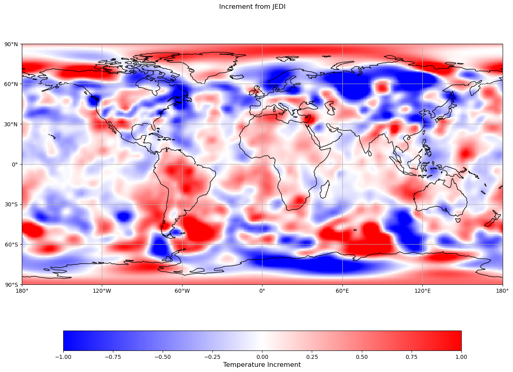

## Background concept

EDA stands for Ensemble of Data Assimilation. The `eda-atmos` suite is a JEDI block-EDA version that applies brute-force 3D-Var optimization 
for each independent member state. Random observation errors are also included into the cost function for minization.
The ensemble mean and ensemble spread from analysis output are of siginicance to assmilation quality.

## Create a Swell `eda_atmos` experiment:

To create a `eda_atmos` suite in swell, run the following command

```bash
swell create eda_atmos
```

Append `-o override.yaml` to above command to fine tune the experiment.yaml file generated by SWELL (`-o` or `--override`).

## The overall workflow

A conventional 3D-Var minimization is invoked for each member state and the resulting ensemble anlysis states are the final products from 3D-EDA.


1. The driver for this mechanism is defined in `flow.cylc`

```cylc
   
   EDA_start-{{model_component}} => RunJediEdaExecutable_mem{{i}}-{{model_component}} => EDA_end-{{model_component}}
   ...

   [[RunJediEdaExecutable_mem{{i}}-{{model_component}}]] 
     script = "swell task RunJediEdaExecutable $config -d $datetime -m {{model_component}} -imem {{i}}"
   ...
```

The independent SWELL tasks `RunJediEdaExecutable -imem i` are submitted to the queue for 3D-Var type computation, where its yaml input files are customized for observation perturbations.


2. Observation thinning:

   EDA calculations demands a significant amount of computational resources. For test runs, users can thin the observartion data by setting `obs_thinning_rej_fraction` from zero (no thinning) to 1 (reject all). Example override file contains:

```cylc
  geos_atmosphere:
    horizontal_resolution: "91"
    obs_thinning_rej_fraction: 0.98
    ensemble_num_members: 3
    observations: [ "sondes" ]
```

   The underlying obs thinning function is performed by
```Bash
   swell task RunJediObsfiltersExecutable $config -d $datetime -m geos_atmosphere
```

3. Launch the eda-atmos experiment

If `swell create eda-atmos` is successful, you will be provided with a print out to launch the cylc job for the eda-atmos suite, which typically looks like:

```
swell launch /discover/nobackup/.../eda/eda-suite
```


As time elapes, your output directory will look like

```
geos_atmosphere
├── amsua_metop-b.20231009T210000Z_orig.nc4
├── amsua_metop-b.20231009T210000Z.nc4
├── jedi_obsfilters_config.yaml
├── jedi_eda3D_config_mem001.yaml
├── jedi_eda3D_config_mem002.yaml
├── analysis
│   ├── mem001
│   │   ├── eda.amsua_metop-b.20231009T210000Z.nc4
│   │   ├── eda.ana.mem001.20231010_000000z.nc4
│   │   ├── eda.iasi_metop-b.20231009T210000Z.nc4
│   │   ├── eda.inc_iter1.mem001.20231010_000000z.nc4
│   │   ├── eda.sfcship.20231009T210000Z.nc4
│   │   └── eda.sondes.20231009T210000Z.nc4
│   └── mem002
│       ├── eda.amsua_metop-b.20231009T210000Z.nc4
│       ├── eda.ana.mem002.20231010_000000z.nc4
│       ├── eda.iasi_metop-b.20231009T210000Z.nc4
│       ├── eda.inc_iter1.mem002.20231010_000000z.nc4
│       ├── eda.sfcship.20231009T210000Z.nc4
│       └── eda.sondes.20231009T210000Z.nc4

```

These files indicate your `obs thinning` process is successful and the analysis and increment files for each member have been created.


4. Postprocessing tasks (ensemble mean and variance)

Once analysis of each member is obtained, the flow.cylc starts to generate the mean and variance for visualization using tasks below

```
swell task RunJediEnsembleMeanVariance  PATHTO/experiment.yaml -d $date -m geos_atmosphere
swell task RunJediDiffstates PATHTO/experiment.yaml -d $date -m geos_atmosphere
```

The output files look like:
```
geos.prior.mean.20231010_000000z.nc4        [mean of ebkg in CS grid]
geos.prior.mean.ll.20231010_000000z.nc4     [... in LL grid]
geos.prior.variance.20231010_000000z.nc4    [variance of ebkg in CS grid]
geos.prior.variance.ll.20231010_000000z.nc4 [... in LL grid]
...
eda.ana.mean.20231010_000000z.nc4           [mean of analysis in CS grid]
eda.ana.mean.ll.20231010_000000z.nc4        [... in LL grid]
eda.ana.variance.20231010_000000z.nc4       [variance of anlaysis in CS grid]
eda.ana.variance.ll.20231010_000000z.nc4    [... in LL grid]
...
eda.mean-inc.20231010_000000z.nc4           [mean increment in LL grid]
eda.mean-inc.cs.20231010_000000z.nc4        [... in CS grid]
```


5. EVA plots and EDA clean up

The eda-atmos workflow will trigger EVA plot for ensemble mean increment. 
An example of mean T increment at 500 hPa is shown below.

To save disk space on discover, the HofX outputs for individual ensemble members are purged at the end of the flow.
The output directory will look like

```
analysis/
├── mem001
│   ├── eda.ana.mem001.20231010_000000z.nc4
│   ├── eda.inc_iter1.mem001.20231010_000000z.nc4
└── mem002
    ├── eda.ana.mem002.20231010_000000z.nc4
    ├── eda.inc_iter1.mem002.20231010_000000z.nc4
```


An example ensemble mean increment output for temperatuare at 500 hPa from EDA calculations is shown below:

