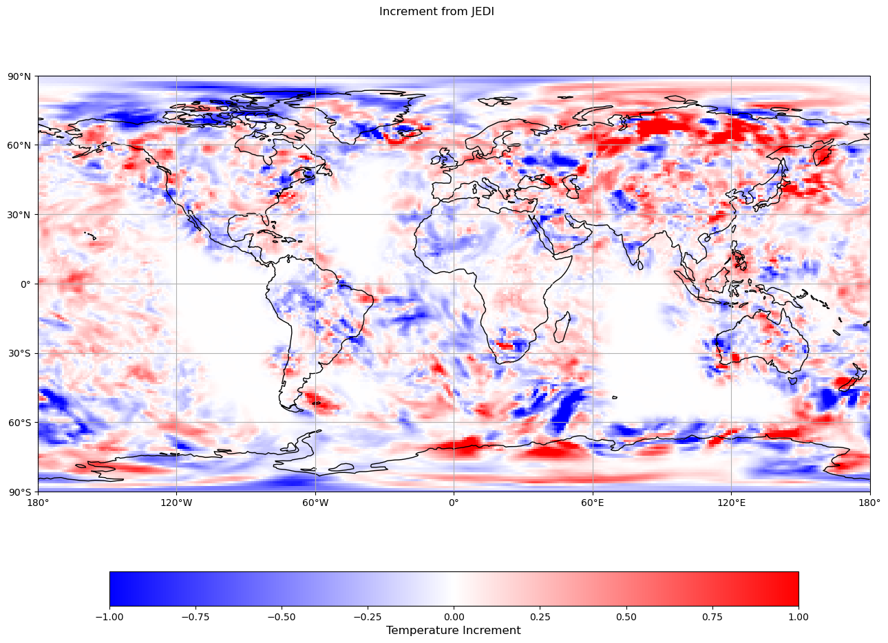

## Background concept

The local ensemble DA workflow from SWELL uses the family of ensemble transform Kalman Filter (ETKF) methods implemented in JEDI, for example, the
local ETKF (LETKF) and the local form of the gain ETKF (LGETKF).  The initial ensemble BKG files come from the GEOS x0050 experiment restart file, for
example.  The solver computes ensemble mean and ensemble perturbations of analysis on local volumes, which is different from global cost function
minimization in EDA.

## Create a SWELL `localensembleda` experiment:

To create a `localensembleda` suite in swell, run the following command

```bash
swell create localensembleda
```

Append `-o override.yaml` to above command to fine tune the experiment.yaml output generated by SWELL (`-o` or `--override`).

## The control specs used in `localensembleda` workflow


1. Example configure file (experiment.yaml)

An excerpt from an example config file shows how to setup a `localensembleda` experiment for an atmospheric ensemble run
with C90/nz=72 resolution using linear observer for deterministic GETKF. 


```yaml
# What is the experiment id?
experiment_id: c90ens

# What is the time of the final cycle (middle of the window)?
final_cycle_point: '2023-10-10T12:00:00Z'

# List of models in this experiment
model_components:
- geos_atmosphere

# Configurations for the model components.
models:

  # Configuration for the geos_atmosphere model component.
  geos_atmosphere:

    # What are the analysis variables?
    analysis_variables:
    - eastward_wind
    - northward_wind
    - air_temperature
    - water_vapor_mixing_ratio_wrt_moist_air
    - ...

    # What is the name of the name of the experiment providing the backgrounds?
    background_experiment: x0050

    # How long before the middle of the analysis window did the background providing forecast begin?
    background_time_offset: PT3H

    # Shall variational bc be changed to static bc in local ensemble DA yaml?
    change_vbc_to_sbc: false

    # Provide the log naming convention (e.g. 'variational', 'fgat').
    comparison_log_type: localensembleda

    # What is the path to the CRTM coefficient files?
    crtm_coeff_dir: /discover/nobackup/projects/gmao/advda/SwellStaticFiles/jedi/crtm_coefficients/2.4.1/

    # Enter the cycle times for this model.
    cycle_times:
    - T00

    # Do you want to use cycling VarBC option?
    cycling_varbc: false

    # How many members comprise the ensemble?
    ensemble_num_members: 32

    # Calculate ensemble mean only?
    ensmean_only: false

    # Calculate ensemble mean and variance only?
    ensmeanvariance_only: false

    # What is the path to the GEOS X-backgrounds directory?
    geos_x_ensemble_directory: /discover/nobackup/projects/gmao/dadev/rtodling/archive/541/Milan

    # What is the length scale for horizontal covariance localization?
    horizontal_localization_lengthscale: 10000000.0

    # What is the maximum number of observations to consider for horizontal covariance localization?
    horizontal_localization_max_nobs: 1000

    # Which localization scheme should be applied in the horizontal?
    horizontal_localization_method: Horizontal Gaspari-Cohn

    # What is the horizontal resolution for the forecast model and backgrounds?
    horizontal_resolution: '91'

    # Save the posterior ensemble members?
    local_ensemble_save_posterior_ensemble: false

    # Save the posterior ensemble member increments?
    local_ensemble_save_posterior_ensemble_increments: false

    # Save the posterior ensemble mean?
    local_ensemble_save_posterior_mean: true

    # Save the posterior ensemble mean increment?
    local_ensemble_save_posterior_mean_increment: true

    # Which local ensemble solver type should be implemented?
    local_ensemble_solver: Deterministic GETKF

    # Which local ensemble solver type should be implemented?
    local_ensemble_use_linear_observer: true

    # Should a log (base 10) transformation be applied to vertical coordinate when constructing vertical localization?
    vertical_localization_apply_log_transform: true

    # Which localization scheme should be applied in the vertical?
    vertical_localization_function: Gaspari Cohn

    # Which coordinate should be used in constructing vertical localization?
    vertical_localization_ioda_vertical_coord: pressure

    # Which vertical coordinate group should be used in constructing vertical localization?
    vertical_localization_ioda_vertical_coord_group: MetaData

    # What is the length scale for vertical covariance localization?
    vertical_localization_lengthscale: 4

    # What is the vertical localization unit for GETKF?
    vertical_localization_unit: logp

    # What is the fraction of vertical retained variance for GETKF?
    vertical_localization_frac_retained_variance: 0.95

    # What localization scheme should be applied in constructing a vertical localization?
    vertical_localization_method: Vertical localization

    # What is the vertical resolution for the forecast model and background?
    vertical_resolution: '72'

    # What is the rejection fraction for obs thinning?
    obs_thinning_rej_fraction: 0.5

    # What is the duration for the data assimilation window?
    window_length: PT6H

    # Do you want to use a 3D or 4D (including FGAT) window?
    window_type: 3D

...

```

2. Commonly used keywords for tasks


   - `obs_thinning_rej_fraction`: 0.5

     is the parameter used in `swell task RunJediObsfiltersExecutable` to thin observation data using GaussianThinning.

   -  `local_ensemble_solver`: Deterministic GETKF / Deterministic LETKF

   prescribes the solver type for ETKF methods

   -  `local_ensemble_use_linear_observer`: true

   specifies if linear observer method will be used for HofX calculations on ensemble states

   -  horizontal localization scale is applied to observation error covariance matrix via keywords:

   `horizontal_localization_method`: Horizontal Gaspari-Cohn

   `horizontal_localization_lengthscale`: 10000000.0

   - vertical localization scale is applied to background error covariance matrix and a few tunable parameters include:

    `vertical_localization_lengthscale`: 4

    `vertical_localization_unit`: logp

    `vertical_localization_frac_retained_variance`: 0.95


More information on the algorithm can be found in the JEDI documentation: https://jcsda-jedi-docs.readthedocs-hosted.com/en/latest/inside/jedi-components/oops/applications/localensembleda.html


3. EVA plots

Example output for the ensemble mean increment in temperature at 500 hPa is shown below:

