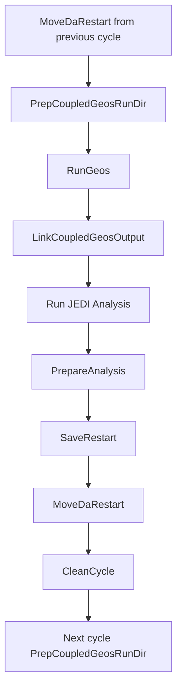

# Coupled Marine GEOS Cycling in SWELL

This document describes how GEOS forecasts are executed and cycled within SWELL workflows, particularly for coupled data assimilation experiments with marine (ocean+sea-ice components).

**Note:** Currently, this workflow only handles marine DA but can handle both coupled and dataAtm modes of executing GEOSgcm.

## Overview

The GEOS cycling workflow involves several key tasks that prepare, execute, and post-process coupled atmosphere-ocean-ice forecasts. The cycle typically follows this pattern:

1. **Initial Setup**: Obtain restart files and prepare the experiment directory
2. **Cycle Preparation**: Configure the `GEOSgcm/forecast` directory for the current forecast
3. **Forecast Execution**: Run the GEOS coupled model (`gcm_run.j`)
4. **Post-Processing & DA**: Link outputs for JEDI, calculate & save analyses, and move restart files to the next cycle

## Calling `gcm_run.j` in Cylc

### Workflow Definition

In the `flow.cylc` file, GEOS is executed through the `RunGeos` task. This task directly calls the `gcm_run.j` script that was prepared in the forecast directory:

```jinja2
[[RunGeos]]
    script = "{{experiment_path}}/GEOSgcm/forecast/gcm_run.j"
    platform = {{platform}}
    [[[directives]]]
    
        --{{key}} = {{value}}
    
```

The `gcm_run.j` script is a GEOS-native job script that:
- Sets up the computational environment with SLURM directives (see [SLURM Configuration](/configuration_reference/slurm_configuration.md) for more details.)
- Defines directory paths (HOMDIR, EXPDIR, GEOSDIR, GEOSBIN, etc.)
- Loads required modules and libraries
- Executes the GEOSgcm.x binary
- Manages model output and restart files. Typically this part is manually modified or taken out as SWELL can handle this part already. In future gcm_run versions, this might be handled in a more modular fashion to better integrate with workflow management systems like SWELL.

### Task Dependencies

The `RunGeos` task has specific dependencies defined in the workflow:

```jinja2
# Model cannot run without code
BuildGeosByLinking? | BuildGeos => RunGeos

# Need first set of restarts to run model
GetCoupledGeosRestart => PrepCoupledGeosRunDir

# Model preperation
MoveDaRestart-{{model_component}}[-{{window_length}}] => PrepCoupledGeosRunDir
PrepCoupledGeosRunDir => RunGeos
```

This ensures that:
- GEOS source code is built or linked before execution
- Initial restarts are obtained for the first cycle
- For subsequent cycles, analysis restarts from the previous cycle are moved first
- The `forecast` directory is prepared before model execution

## Getting GEOS Restart Files: `GetCoupledGeosRestart`

The `GetCoupledGeosRestart` task handles obtaining the initial restart files needed to start the GEOS coupled simulation. It is important to note that there is no control mechanism within GEOSgcm or SWELL for the time validity of these restarts; users must ensure that the restarts correspond to the correct cycle date.

### Restart Sources

The task supports three methods for obtaining restart files, controlled by the `initial_restarts_method` configuration:

#### 1. From a GEOS Experiment Directory (`geos_expdir`)

This is the most common method. Restart files are copied from an existing GEOS experiment:

```yaml
initial_restarts_method: geos_expdir
```

The task copies:
- **Atmosphere grid and boundary restarts**: All `*_rst` files (e.g., `fvcore_internal_rst`, `moist_internal_rst`, etc.)
- **CICE6 restart**: `RESTART/iced.nc`
- **MOM6 restarts**: All `RESTART/MOM.res*.nc` files
- **Optional files**: `RESTART/mom6_increment.nc` (for IAU mode)
- **Binary files**: `GEOSgcm.x` (model executable) and `linkbcs` (boundary condition links)
- **RC directory**: Complete directory of resource configuration files

#### 2. From R2D2 (`r2d2`)

```yaml
initial_restarts_method: r2d2
```

This method retrieves restarts from the R2D2 data repository. **Note**: This functionality is not yet fully implemented.

#### 3. Hotstart (`hotstart`)

```yaml
initial_restarts_method: hotstart
```

In hotstart mode, the task assumes restart files already exist in the forecast directory (e.g., manually placed or to resume from a previous run). No files are copied.

### Directory Structure Setup

The task also establishes the internal GEOS directory structure within the SWELL experiment:

```
{experiment_path}/
└── GEOSgcm/
    ├── GEOS_homdir/    → symlink to geos_homdir
    ├── GEOS_expdir/    → symlink to geos_expdir (if different from homdir)
    └── forecast/
        ├── RESTART/
        │   ├── iced.nc
        │   ├── MOM.res.nc
        │   └── MOM.res_1.nc (if using multiple restart files)
        ├── *_rst files
        ├── GEOSgcm.x
        └── linkbcs
```

### Configuration Options

Key configuration parameters:

```yaml
# Location of GEOS HOMDIR (model settings and RC files)
geos_homdir: /path/to/geos/homdir

# Is EXPDIR different from HOMDIR?
geos_expdir_different: false

# If true, specify EXPDIR location
geos_expdir: /path/to/geos/expdir

# Method for obtaining initial restarts
initial_restarts_method: geos_expdir
```

## Preparing the Run Directory: `PrepCoupledGeosRunDir`

The `PrepCoupledGeosRunDir` task configures the forecast directory for the current cycle. This task is executed before every forecast (not just the initial cycle).

Some of the DA required setup is assumed to happen in the `geos_homdir` already as they are not handled by `gcm_setup` automatically. One critical component is including the `MOM_oda_incupd` file for MOM6 IAU configuration in the `forecast` directory. Most of this is described under the appropriate [model configurations](../../configuration_reference/model_configurations) page.

### Main Operations

#### 1. Copy Static Files

The task copies required model configuration files from GEOS_homdir/GEOS_expdir:

**Required files**:
- `AGCM.rc` - Atmosphere model configuration
- `CAP.rc` - Coupled model controller configuration
- `gcm_run.j` - Job submission script
- `HISTORY.rc` - History output configuration
- `fvcore_layout.rc` - FV3 core layout settings
- `input.nml` - Namelist inputs
- `ice_in` - CICE6 configuration
- `MOM_input` - MOM6 main configuration
- `MOM_override` - MOM6 parameter overrides
- `diag_table` - Diagnostic output table
- `data_table` - Data input table
- Other supporting files

**Optional files** (if present):
- `MOM_oda_incupd` - MOM6 IAU (Incremental Analysis Update) configuration
- `MOM_saltrestore` - MOM6 salt restoring configuration (this is not recommended when SSS is assimilated)

**Directories**:
- `RC/` - Complete resource configuration directory
- `GEOSgcm.x` - Model executable
- `linkbcs` - Boundary condition links

#### 2. Modify Path Configurations in `gcm_run.j`

The task updates directory paths in the job script to point to the current forecast directory:

```python
with open(self.forecast_dir('gcm_run.j'), "r") as infile:
    lines = infile.readlines()

with open(self.forecast_dir('gcm_run.j'), "w") as outfile:
    for line in lines:
        # Update EXPDIR to current forecast directory
        if re.match(r'^\s*setenv\s+EXPDIR\b', line):
            outfile.write(f"setenv EXPDIR {self.forecast_dir()}\n")
        # Update HOMDIR to current forecast directory
        elif re.match(r'^\s*setenv\s+HOMDIR\b', line):
            outfile.write(f"setenv HOMDIR {self.forecast_dir()}\n")
        else:
            outfile.write(line)
```

This ensures GEOS uses the experiment-specific directory rather than the original experiment directory.

#### 3. Adjust Model Configuration Files

**Background Frequency** (`ice_in` and `diag_table`):
```python
bkgr_freq = self.config.get_key_for_model('background_frequency', 'geos_marine', 'PT3H')
self.geos.process_icein(bkgr_freq)
self.geos.process_diag_table(bkgr_freq)
```

This allows GEOS to output backgrounds at the correct frequency for different DA window configurations without modifying the original experiment files. If no `background_frequency` is set (e.g., for 3DVar or LETKF) the default is `PT3H`.

**MOM6 IAU Configuration**:

If MOM6 IAU (Incremental Analysis Update) is enabled and a `mom6_increment.nc` file exists in the RESTART directory:

```python
if self.config.get_key_for_model('mom6_iau', 'geos_marine', False):
    if os.path.exists(self.forecast_dir('RESTART/mom6_increment.nc')):
        # Augment MOM_input with MOM_oda_incupd configuration
        # Set ODA_INCUPD_NHOURS based on configuration
```

This enables gradual application of analysis increments over the forecast window.

**Cold Start vs. Warm Start**:
```python
self.geos.process_inputnml()
```

Modifies `input.nml` to indicate warm restart (default) or cold start. This is to make sure `n` is switched to `r` in `input.nml`. Otherwise, the model will bootstrap and initiate a cold start.

#### 4. Modify Resource Configuration Files

**CAP.rc** (Coupled model controller):
```python
self.cap_dict = self.rewrite_cap(self.cap_dict, self.forecast_dir('CAP.rc'))
```

Updates:
- `JOB_SGMT`: Segment duration matching `forecast_duration`
- `NUM_SGMT`: Set to 1 (run one segment per cycle)
- `END_DATE`: Set far into future to avoid premature termination

Example modification for a PT12H forecast:
```
NUM_SGMT: 1
JOB_SGMT: 0000000 120000  # 12 hours in HHMMSS format
END_DATE: 50010101 000000  # Far future date
```

**AGCM.rc** (Atmosphere model):
```python
if 'RECORD_FREQUENCY' in self.agcm_dict:
    self.rewrite_agcm(self.agcm_dict, self.forecast_dir('AGCM.rc'))
```

Updates restart record parameters:
- `RECORD_FREQUENCY`: Interval for writing restart checkpoints
- `RECORD_REF_DATE`: Reference date for restart output timing
- `RECORD_REF_TIME`: Reference time for restart output timing

This ensures restarts are written at the DA window boundaries for seamless cycling.

#### 5. Create `cap_restart` File

Creates the `cap_restart` file with the forecast start time:

```python
with open(self.forecast_dir('cap_restart'), 'w') as file:
    file.write(self.fc_dto.strftime("%Y%m%d %H%M%S"))
```

Format: `YYYYMMDD HHMMSS` (e.g., `20210701 000000`)

### Timing Calculation

The task calculates the forecast start time based on the cycle time and forecast duration:

```python
# Forecast starts 3/4 of forecast_duration before cycle time
# This accounts for the DA window offset
self.fc_dto = self.cycle_time_dto() - isodate.parse_duration(self.forecast_duration) * 3 / 4
```

For example, with:
- `cycle_time`: 2021-07-01T12:00:00Z
- `forecast_duration`: PT12H
- Forecast starts at: 2021-07-01T03:00:00Z (9 hours before cycle time)

**Note**: This part could be adjusted depending on the specific DA window configuration and forecast duration, however notice that there are forecast only suites without the DA parameters.

## File Movement Between `forecast` and `scratch` Folders

Understanding the data flow between directories is crucial for managing GEOS cycles in SWELL.

### Directory Structure

```
{experiment_path}/GEOSgcm/
└── forecast/              # Prepared run directory (cycle-specific)
    ├── scratch/           # GEOS runtime output directory
    │   ├── RESTART/       # Model restart files written during forecast
    │   └── his_*.nc       # History output files
    ├── RESTART/           # Restart files for next forecast
    ├── gcm_run.j          # Job script
    ├── *_rst              # Atmosphere restart files
    ├── CAP.rc, AGCM.rc    # Configuration files
    └── ...
```

### GEOS Output During Forecast

When `gcm_run.j` executes, GEOS writes outputs to the `scratch/` subdirectory:

1. **History Files**: `scratch/his_YYYY_MM_DD_HH.nc` (MOM6 ocean backgrounds) and `scratch/iceh_{hour_prefix}.{date_str}-{seconds:05d}.nc` (CICE6 sea ice)
2. **Restart Files**:
   - `scratch/*_checkpoint` or `scratch/*_checkpoint.YYYYMMDD_HHMMz.nc4` (atmosphere)
   - `scratch/RESTART/iced.nc` (CICE6 sea ice)
   - `scratch/RESTART/MOM.res*.nc` (MOM6 ocean)
   - `scratch/tile.bin` (tile interface file)
3. **History Restart Files**: `scratch/*.rcx` (for history file continuation)

### Linking Outputs for JEDI: `LinkCoupledGeosOutput`

After the forecast completes, the `LinkCoupledGeosOutput` task creates symbolic links from `scratch/` to the cycle directory for JEDI to access:

For **3DVar** (single background):
- One ocean history file at the background time
- One CICE6 restart file one history file

For **4D methods** (3DFGAT, 4DVar):
- Multiple ocean history files at different time slots
- Multiple CICE6 history files at different time slots and one restart file
- Based on `background_frequency` configuration

### Moving Restart Files: `MoveDaRestart`

The `MoveDaRestart` task moves restart files from `scratch/` to the forecast directory's `RESTART/` subdirectory for the next cycle:

#### Atmosphere Restarts

```python
# Move checkpoint files
src = self.forecast_dir(['scratch', '*_checkpoint'])
```

If `RECORD_FREQUENCY` is enabled in AGCM.rc, restarts have timestamps:
```python
# Time-stamped format
src = self.forecast_dir(['scratch', rst_dto.strftime('*_checkpoint.%Y%m%d_%H%Mz.nc4')])
```

Examples:
- `fvcore_internal_checkpoint.20210701_0900z.nc4`
- `moist_internal_checkpoint.20210701_0900z.nc4`

Files are moved and renamed (strip timestamp):
```
scratch/fvcore_internal_checkpoint.20210701_0900z.nc4 → fvcore_internal_checkpoint
```

#### Ocean and Ice Restarts

```python
# CICE6 restart
move_files(self.logger, 
           self.forecast_dir('scratch/RESTART/iced.nc'), 
           self.forecast_dir('RESTART/iced.nc'))

# Tile interface file
move_files(self.logger, 
           self.forecast_dir('scratch/tile.bin'), 
           self.forecast_dir('tile.bin'))
```

#### MOM6 Multiple Restart Files

MOM6 can write multiple restart files for high-resolution simulations. The task handles both single and multiple restart scenarios:

```python
# Without RECORD_FREQUENCY
src = self.forecast_dir(['scratch', 'RESTART', 'MOM.res*nc'])

# Time-stamped
# With RECORD_FREQUENCY active in AGCM.rc and #override RESTART_CONTROL = 2 set in MOM_override
rst_pattern = rst_dto.strftime('MOM.res_Y%Y_D%j_S') + seconds_str + '*.nc'
```

Examples of time-stamped MOM6 restarts:
- `MOM.res_Y2021_D182_S32400.nc` (main restart)
- `MOM.res_Y2021_D182_S32400_1.nc` (additional PE domain)
- `MOM.res_Y2021_D182_S32400_2.nc` (additional PE domain)

These are renamed to remove the timestamp:
```
scratch/RESTART/MOM.res_Y2021_D182_S32400.nc    → RESTART/MOM.res.nc
scratch/RESTART/MOM.res_Y2021_D182_S32400_1.nc  → RESTART/MOM.res_1.nc
```

#### MOM6 IAU Increment

If MOM6 IAU is enabled, the increment file is also moved:

```python
if self.mom6_iau:
    move_files(self.logger,
               os.path.join(self.cycle_dir(), 'mom6_increment.nc'),
               self.forecast_dir(['RESTART', 'mom6_increment.nc']))
```

This allows the next forecast to apply the analysis increment gradually.

#### History Restart Files

History restart files (`.rcx`) are moved to maintain continuity in GEOS HISTORY outputs:

```python
rcx_files = os.path.join(self.forecast_dir('scratch'), '*.rcx')
for filepath in list(glob.glob(rcx_files)):
    filename = os.path.basename(filepath)
    dst_path = os.path.join(self.forecast_dir(), filename)
    move_files(self.logger, filepath, dst_path)
```

### Complete File Flow Example

Here's a complete example of file movement through one DA cycle:

**Initial State** (Cycle 1 - 2021-07-01T12:00:00Z):
```
forecast/
├── RESTART/
│   ├── iced.nc                    # From GetCoupledGeosRestart
│   ├── MOM.res.nc                 # From GetCoupledGeosRestart
│   └── MOM.res_1.nc
├── fvcore_internal_rst            # From GetCoupledGeosRestart
├── moist_internal_rst
└── ...
```

**After PrepCoupledGeosRunDir**:
```
forecast/
├── RESTART/              # Previous restarts ready for forecast
├── gcm_run.j            # Modified job script
├── CAP.rc               # Modified for forecast duration
├── AGCM.rc              # Modified with RECORD_FREQUENCY settings
├── ice_in               # Modified for background frequency
├── MOM_input            # Potentially augmented with MOM_oda_incupd
└── cap_restart          # Created with forecast start time
```

**After RunGeos**:
```
forecast/
├── RESTART/              # Old restarts (still present)
├── scratch/
│   ├── his_2021_07_01_03.nc      # History at window begin (for DA window 6hr)
│   ├── his_2021_07_01_06.nc      # History at mid-window (for DA window 6hr)
│   ├── his_2021_07_01_09.nc      # History at window end (for DA window 6hr)
│   ├── fvcore_internal_checkpoint.20210701_0900z.nc4
│   ├── moist_internal_checkpoint.20210701_0900z.nc4
│   ├── RESTART/
│   │   ├── iced.nc
│   │   ├── MOM.res_Y2021_D182_S32400.nc
│   │   └── MOM.res_Y2021_D182_S32400_1.nc
│   └── tile.bin
└── ...
```

**After LinkCoupledGeosOutput**:
```
cycle_dir/
├── ocn.bkg.2021-07-01T03:00:00Z.nc → ../forecast/scratch/his_2021_07_01_03.nc
├── ocn.bkg.2021-07-01T06:00:00Z.nc → ../forecast/scratch/his_2021_07_01_06.nc
├── ocn.bkg.2021-07-01T09:00:00Z.nc → ../forecast/scratch/his_2021_07_01_09.nc
└── iced.res.2021-07-01T09:00:00Z.nc → ../forecast/scratch/RESTART/iced.nc
```

**After MoveDaRestart** (preparing for next cycle):
```
forecast/
├── RESTART/
│   ├── iced.nc                    # Moved from scratch/RESTART/
│   ├── MOM.res.nc                 # Moved and renamed from scratch/RESTART/
│   ├── MOM.res_1.nc               # Moved and renamed from scratch/RESTART/
│   └── mom6_increment.nc          # Moved from cycle_dir/ (if IAU enabled)
├── fvcore_internal_checkpoint     # Moved and renamed from scratch/
├── moist_internal_checkpoint      # Moved and renamed from scratch/
├── tile.bin                       # Moved from scratch/
└── *.rcx                          # Moved from scratch/
```

The cycle then repeats for the next analysis time.

## Task Sequence in the Workflow

The complete task sequence for a typical DA cycle is:



**Cycle N-1 to Cycle N**:
1. `MoveDaRestart[-window_length]`: Move analysis restarts from previous cycle
2. `PrepCoupledGeosRunDir`: Configure forecast directory for current cycle
3. `RunGeos`: Execute `gcm_run.j` to run forecast
4. `LinkCoupledGeosOutput`: Link model outputs for JEDI
5. `GetObservations`: Retrieve observations for current cycle
6. `RunJediFgatExecutable`: Run JEDI analysis
7. `PrepareAnalysis`: Prepare analysis for next forecast
8. `SaveRestart`: Save analysis state to R2D2 (optional)
9. `MoveDaRestart`: Move analysis restarts to next cycle directory
10. `CleanCycle`: Remove large intermediate files

## Configuration Tips

### Configuring Window Length and Forecast Duration

The relationship between window length and forecast duration is important:

```yaml
forecast_duration: PT12H    # Total forecast length

models:
  geos_marine:
    window_length: PT6H     # DA window length
```

For a 6-hour DA window with 12-hour forecast:
- Forecast runs from T-9h to T+3h (where T is cycle time)
- DA window is from T-3h to T+3h
- GEOS outputs backgrounds within the window

### Configuring Background Frequency

For 4D methods (3DFGAT):

```yaml
models:
  geos_marine:
    background_frequency: PT1H  # Output backgrounds every hour
    window_type: 4D
```

This generates backgrounds at multiple time slots within the DA window.

### Configuring MOM6 IAU

For incremental analysis update:

```yaml
models:
  geos_marine:
    mom6_iau: true
    mom6_iau_nhours: PT6H  # Apply increment over 6 hours
```

### Configuring AGCM Restart Record and MOM_override

To enable time-stamped restarts for precise DA window alignment:

In your GEOS HOMDIR, edit `AGCM.rc`:
```
RECORD_FREQUENCY: 060000        # Write restarts every 6 hours
RECORD_REF_DATE: 20210701       # Reference date (updated by SWELL)
RECORD_REF_TIME: 090000         # Reference time (updated by SWELL)
```

SWELL will automatically update `RECORD_REF_DATE` and `RECORD_REF_TIME` to match the DA window boundaries.

Add in your `MOM_override`:

```
#override RESTART_CONTROL = 2
```

## Common Issues and Solutions

### Issue: Restarts at Wrong Time

**Symptom**: Restarts don't align with DA window boundaries

**Solution**: Enable `RECORD_FREQUENCY` in AGCM.rc and ensure `forecast_duration` is longer than `window_length`

### Issue: MOM6 Increment Not Applied

**Symptom**: Analysis has minimal impact on subsequent forecasts

**Solution**:
1. Check that `mom6_iau: true` in experiment.yaml
2. Verify `mom6_increment.nc` exists in cycle directory after JEDI analysis
3. Check that `MOM_oda_incupd` file is being augmented to `MOM_input`

### Issue: Missing History Files

**Symptom**: JEDI cannot find background files

**Solution**:
1. Verify `diag_table` and `ice_in` includes ocean and sea-ice history collections
2. Check that history output frequency matches `background_frequency`
3. Ensure `LinkCoupledGeosOutput` completes successfully before JEDI

### Issue: Scratch Directory Fills Up

**Symptom**: Disk quota exceeded errors

**Solution**:
1. Ensure `CleanCycle` task runs after analysis completes
2. Check that `MoveDaRestart` successfully moves files out of scratch
3. Consider reducing HISTORY output frequency if not needed for DA
4. Make sure R2D2 scrubber is active (this is work in progress!)

## Summary

The GEOS cycling workflow in SWELL is designed to seamlessly integrate coupled model forecasts with JEDI data assimilation:

- **Initial Setup**: `GetCoupledGeosRestart` obtains restart files from various sources
- **Cycle Preparation**: `PrepCoupledGeosRunDir` configures the forecast directory with proper paths, timings, and model configurations
- **Forecast Execution**: `gcm_run.j` runs the coupled GEOS model, writing outputs to `scratch/`
- **Output Management**: `LinkCoupledGeosOutput` makes model backgrounds accessible to JEDI
- **Restart Management**: `MoveDaRestart` relocates analysis restarts to prepare for the next cycle
- **Cleanup**: `CleanCycle` removes large intermediate files to manage disk space

This modular approach allows for flexible DA cycling with various window configurations, IAU options, and model resolutions.
